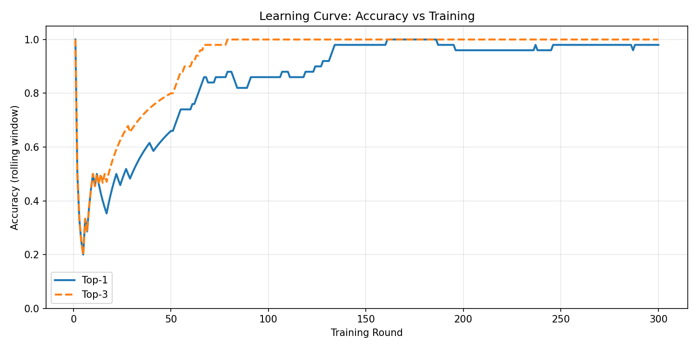
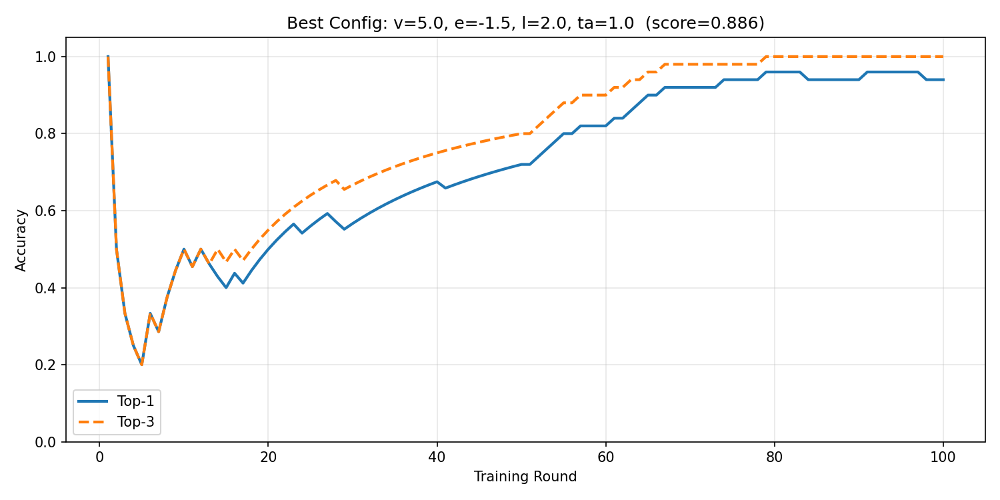
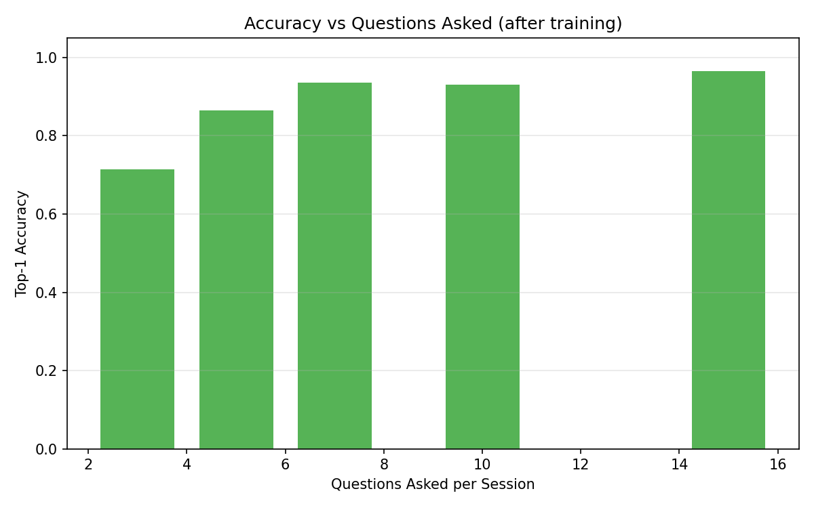
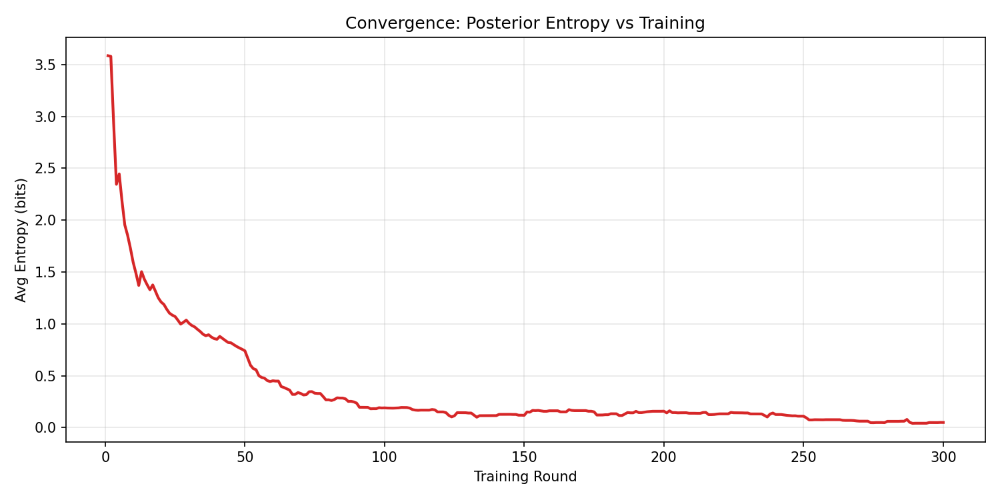
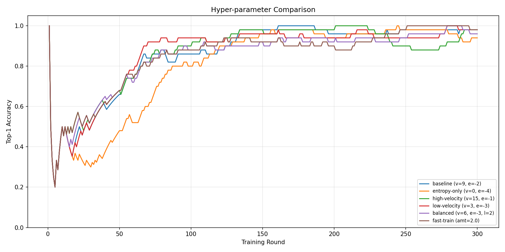
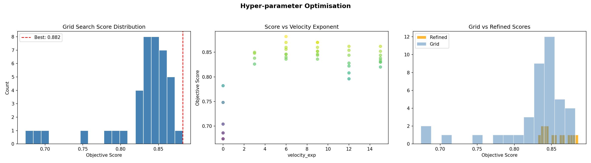
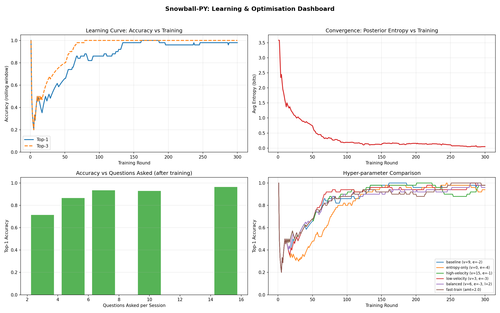

# snowball-py

**snowball-py** is a small, pure-Python toolkit for **probabilistic question answering** in product and service discovery surveys. It maintains Bayesian beliefs over a set of targets, asks informative questions, and can simulate respondents, run benchmarks, optimise hyper-parameters, and plot learning and accuracy curves.

## What it does

- **Inference core** — Maintains posterior weights over targets from survey answers; selects the next question using entropy, how fast beliefs are moving (“velocity”), and how uncertain the top choice still is (“lack”).
- **Interactive & simulated sessions** — Run a live CLI survey or a scripted respondent for repeatable experiments.
- **Benchmarks & graphs** — Learning curves, accuracy versus number of questions, entropy over time, hyper-parameter comparisons, and a compact dashboard-style summary.
- **Hyper-parameter search** — Grid search with local refinement to tune engine settings.

Python **3.11+**, **NumPy**, and **Matplotlib** (see `pyproject.toml`).

## Install

```bash
cd snowball-py
uv sync
```

Or with pip, install from the project directory in the usual way.

## Quick start

```bash
uv run snowball              # interactive survey
uv run snowball --sim        # simulated answers
uv run snowball-bench        # benchmark suite
uv run snowball-graphs       # regenerate Matplotlib figures under plots/
```

Tests:

```bash
uv run pytest
```

## Figures

Representative outputs from the bundled benchmark and graph utilities:

### Learning curve



### Best configuration (learning trajectory)



### Accuracy vs. questions asked



### Entropy convergence



### Hyper-parameter comparison



### Optimisation landscape



### Dashboard summary


